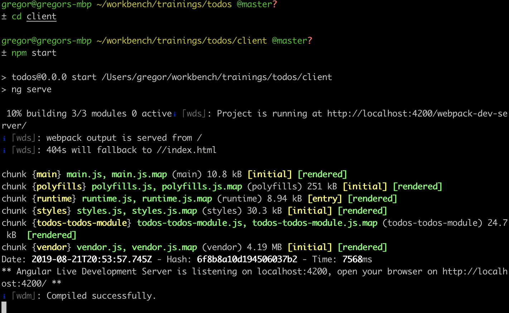
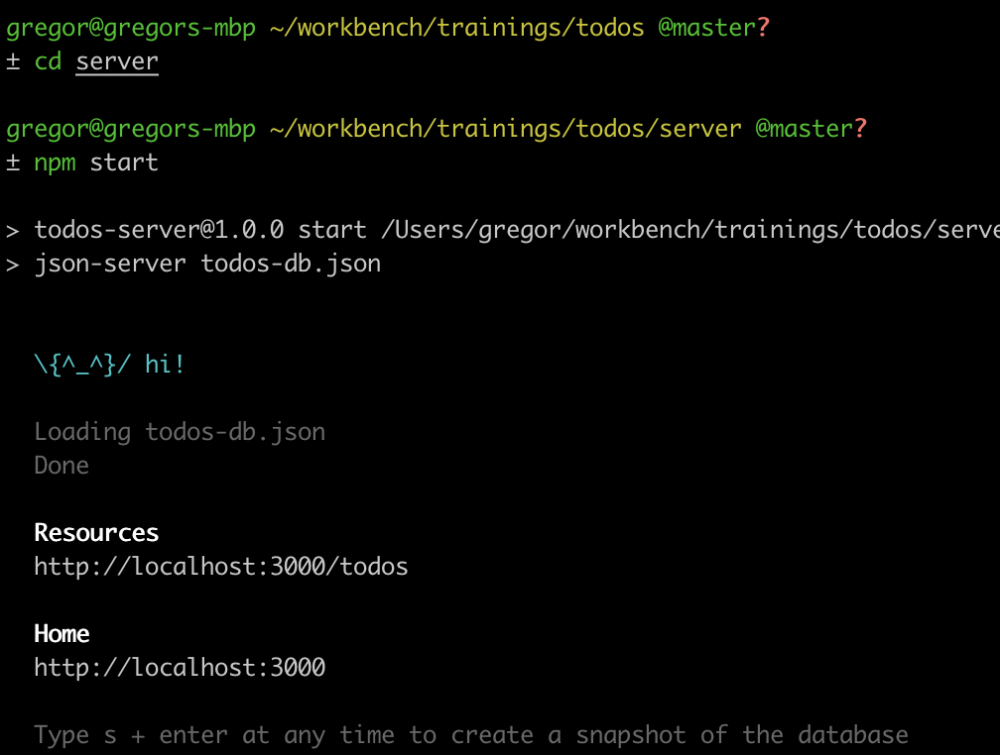

## Angular solid foundations - from zero to hero

> https://ng-de.org/workshops/angular-solid-foundations/

Hello 👋,

we are thrilled to meet you at our training.
Please find your personal preparation guide below.
It helps you to set up your development environment.

If you have any trouble, please don't hesitate to contact [Markus] or [Gregor].

Kind Regards
[Markus] & [Gregor]

[markus]: https://twitter.com/_der_markusende
[gregor]: https://twitter.com/gregonnet

## Slides

👩‍🏫 The [slides](https://speakerdeck.com/gregonnet/angular-solid-foundations-ng-de19) to this workshop can be found at [speakerdeck.com](https://speakerdeck.com/gregonnet/angular-solid-foundations-ng-de19).

## Prerequisites

### Tools

Please ensure you have the following tools already installed before the workshop
starts.

- [Chrome](https://www.google.com/chrome/)
- [Node.js 10 or higher](https://nodejs.org/en/)
- [Visual Studio Code](https://code.visualstudio.com/)

Please install the latest version of Angular CLI.
Open up a terminal on your system and run the following command.

```bash
npm install --global @angular/cli
```

Please check if the setup was successful running the following command in your
terminal.

```bash
ng --version
```

### Code

Please clone this repository to your system and install the needed
dependencies for the Angular application and the Demo-Backend.

```bash
# Download repository
git clone https://github.com/ng-practice/ng-de-2019.git workshop

# Switch into repository directory
cd workshop

# Install dependencies for Angular application
npm install --prefix client

# Install dependencies for Backend
npm install --prefix server
```

Please verify that both angular application and backend run on your system.

**Angular**

> Hint you can exit the development web server hitting <kbd>CTRL</kbd>+<kbd>C</kbd>.

```bash
cd client
npm start
```


_The output of a successfully started Angular application_

**Backend**

> Hint you can exit the development web server hitting <kbd>CTRL</kbd>+<kbd>C</kbd>.

```bash
cd server
npm start
```


_The output of a successfully started backend_

📖️ Please see the [server README](./server/README.md) for an API documentation.
